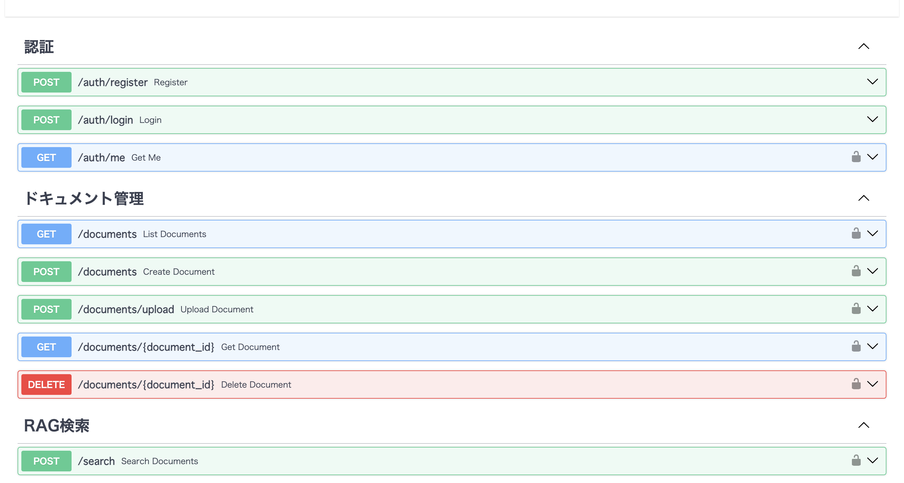
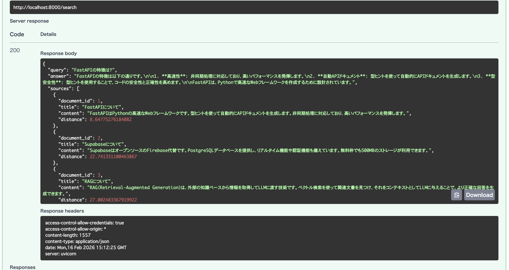

# RAG Knowledge API

FastAPI + PostgreSQL + FAISS を使った RAG（Retrieval-Augmented Generation）搭載のナレッジベース API

[](https://www.python.org/)
[](https://fastapi.tiangolo.com/)
[](https://www.docker.com/)
[](LICENSE)

## 📖 概要

ドキュメントをアップロードして、AI を使った高精度な検索と質問応答ができる API です。

**主な機能:**
- 🔐 JWT 認証によるユーザー管理
- 📄 ドキュメントの CRUD 操作
- 🤖 RAG による高精度な質問応答
- 🔍 FAISS を使った高速ベクトル検索
- 🐳 Docker 対応（一発起動）

## 🛠️ 技術スタック

### Backend
- **FastAPI** - 高速な Web フレームワーク
- **SQLAlchemy** - ORM
- **Alembic** - データベースマイグレーション
- **PyJWT** - JWT 認証

### Database
- **PostgreSQL** - メインデータベース（Supabase）
- **FAISS** - ベクトル検索エンジン

### AI/ML
- **sentence-transformers** - 埋め込み生成
- **Groq API (LLaMA 3.1)** - LLM による回答生成

### Infrastructure
- **Docker** - コンテナ化
- **Render** - ホスティング
- **pytest** - テスト（カバレッジ 86%）

## 🚀 クイックスタート

### 前提条件

- Docker Desktop
- Git

### 1. リポジトリをクローン
```bash
git clone https://github.com/yourusername/rag-knowledge-api.git
cd rag-knowledge-api
```

### 2. 環境変数を設定
```bash
cp .env.example .env
nano .env
```

`.env` に以下を設定:
```bash
GROQ_API_KEY=your-groq-api-key-here
SECRET_KEY=your-secret-key-minimum-32-characters
```

### 3. Docker で起動
```bash
docker compose up
```

### 4. ブラウザで確認
```
http://localhost:8000/docs
```

**→ Swagger UI が開けば成功！**

## 📚 API ドキュメント

### 認証

#### ユーザー登録
```bash
POST /auth/register
Content-Type: application/json

{
  "email": "user@example.com",
  "password": "Password123"
}
```

#### ログイン
```bash
POST /auth/login
Content-Type: application/json

{
  "email": "user@example.com",
  "password": "Password123"
}
```

**レスポンス:**
```json
{
  "access_token": "eyJhbGci...",
  "token_type": "bearer"
}
```

### ドキュメント管理

#### ドキュメント作成
```bash
POST /documents
Authorization: Bearer {token}
Content-Type: application/json

{
  "title": "FastAPI について",
  "content": "FastAPI は高速な Web フレームワークです。"
}
```

#### ドキュメント一覧
```bash
GET /documents
Authorization: Bearer {token}
```

#### RAG 検索
```bash
POST /search
Authorization: Bearer {token}
Content-Type: application/json

{
  "query": "FastAPI の特徴は？",
  "top_k": 3
}
```

**レスポンス:**
```json
{
  "query": "FastAPI の特徴は？",
  "answer": "FastAPIの主な特徴は...",
  "sources": [
    {
      "document_id": 1,
      "title": "FastAPI について",
      "content": "...",
      "distance": 0.234
    }
  ]
}
```

## 🧪 テスト
```bash
# 全テスト実行
poetry run pytest

# カバレッジ測定
poetry run pytest --cov=app --cov-report=html

# カバレッジ結果を確認
open htmlcov/index.html
```

**テストカバレッジ: 86%**

## 🐳 Docker コマンド
```bash
# 起動
docker compose up

# バックグラウンドで起動
docker compose up -d

# 停止
docker compose down

# 完全削除（データも消える）
docker compose down -v

# ログ確認
docker compose logs
```

## 📁 プロジェクト構造
```
rag-knowledge-api/
├── app/
│   ├── api/              # API エンドポイント
│   │   ├── auth.py       # 認証
│   │   ├── documents.py  # ドキュメント管理
│   │   └── search.py     # RAG 検索
│   ├── core/             # コア機能
│   │   ├── security.py   # JWT 認証
│   │   └── deps.py       # 依存性注入
│   ├── models/           # SQLAlchemy モデル
│   │   ├── user.py
│   │   └── document.py
│   ├── schemas/          # Pydantic スキーマ
│   ├── services/         # ビジネスロジック
│   │   ├── embeddings.py # 埋め込み生成
│   │   └── vector_store.py # FAISS 操作
│   ├── config.py         # 設定
│   ├── database.py       # DB 接続
│   └── main.py           # エントリーポイント
├── tests/                # テストコード
├── alembic/              # マイグレーション
├── docker-compose.yml    # Docker 設定
├── Dockerfile
├── pyproject.toml        # Poetry 設定
└── README.md
```

## 🔧 開発環境セットアップ（Docker なし）

### 1. Python 3.12 をインストール
```bash
pyenv install 3.12.2
pyenv local 3.12.2
```

### 2. Poetry をインストール
```bash
curl -sSL https://install.python-poetry.org | python3 -
```

### 3. 依存パッケージをインストール
```bash
poetry install
```

### 4. データベースマイグレーション
```bash
poetry run alembic upgrade head
```

### 5. サーバー起動
```bash
poetry run uvicorn app.main:app --reload
```

## 🌐 デプロイ

### Render へのデプロイ

1. GitHub にプッシュ
2. Render にログイン
3. "New +" → "Blueprint"
4. リポジトリを選択
5. `render.yaml` を自動検出
6. "Apply" をクリック

**環境変数（Render で設定）:**
- `GROQ_API_KEY`
- `SECRET_KEY`（自動生成）

## 📊 技術的な工夫点

### 1. RAG の実装

- **埋め込み生成**: sentence-transformers（多言語対応モデル）
- **ベクトル検索**: FAISS（Meta 製、本番環境で実績）
- **LLM**: Groq API（高速、無料枠が大きい）

### 2. セキュリティ

- JWT トークン（24時間有効）
- パスワードハッシュ化（bcrypt）
- CORS 設定
- 環境変数管理

### 3. パフォーマンス

- FAISS による高速ベクトル検索
- 非同期処理（FastAPI）
- コネクションプーリング
- ベクトルストアの永続化

### 4. テスト

- pytest によるユニットテスト
- モック化（Groq API）
- カバレッジ 86%
- CI/CD 対応

## 🤝 コントリビューション

Pull Request を歓迎します。

1. Fork する
2. Feature ブランチを作成 (`git checkout -b feature/amazing-feature`)
3. コミット (`git commit -m 'Add amazing feature'`)
4. プッシュ (`git push origin feature/amazing-feature`)
5. Pull Request を開く

## 📝 ライセンス

MIT License

## 👤 作成者

**Roy Bryant**
- GitHub: [@yourusername](https://github.com/yourusername)
- Email: royantbryant@gmail.com

## 🙏 謝辞

- FastAPI コミュニティ
- Anthropic（Claude）
- Groq（無料 LLM API）

## 📸 スクリーンショット

### Swagger UI


### RAG 検索


## 🔗 リンク

- [本番環境](https://rag-knowledge-api.onrender.com/docs)
- [GitHub リポジトリ](https://github.com/yourusername/rag-knowledge-api)